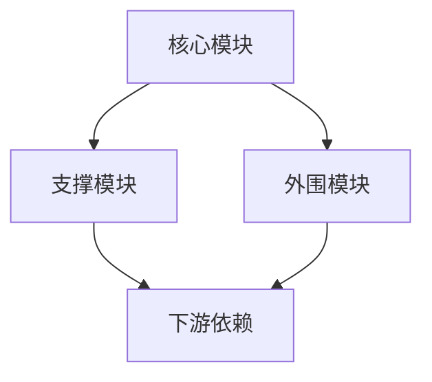
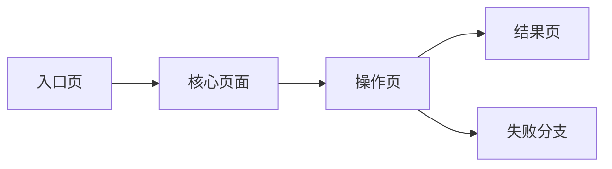
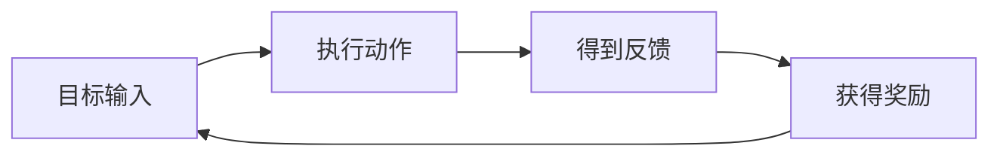
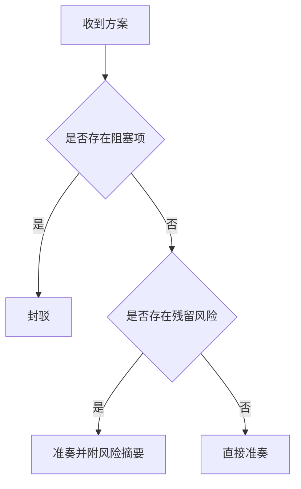
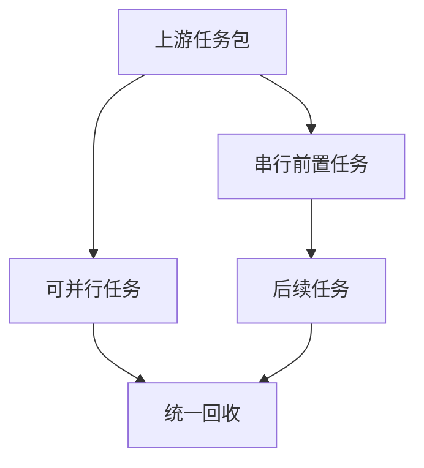
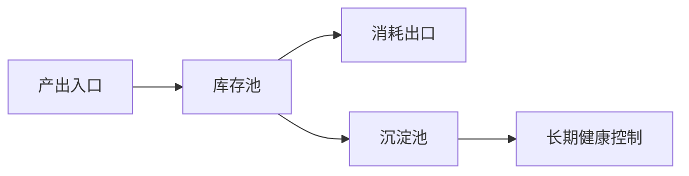

# Output Templates

用于统一 `game-agents` 各环节的正式产物格式。默认遵循“先摘要、再正文、后风险/待决项”的渐进式披露顺序。

## 双层交付原则

当某类产物同时需要给下游 Agent 使用、也需要给人做阶段确认时，默认采用：

1. **结构层**：正文中的结构化事实、表格、字段块
2. **视图层**：从结构层派生的 Mermaid / HTML 图表 / 图形化摘要

注意：

- 图表不是唯一信息源，结构层才是单一事实来源
- 先写结构层，再补视图层
- 图里出现的节点名、阶段名、模块名应与结构层保持一致
- 具体边界见 `docs/diagram-output-strategy.md`
- 若产物是 HTML / GDD 型页面，页面骨架与图表实现优先参考 `docs/gdd-html-patterns.md`

## 通用写法

所有正式输出建议包含：

1. 摘要：一句话结论或本轮目标
2. 核心正文：按该模板要求展开
3. 风险与待决项：只列真正影响后续流转的问题
4. 下一步流转：明确交给谁、要什么动作

## 1. 《立项旨意书》

适用 Agent：`taizi`

```markdown
# 立项旨意书

## 一句话目标
- [本次需求的核心目标]

## 背景与意图
- [为何要做]
- [当前用户或业务背景]

## 关键约束
- [题材/平台/人群/版本/成本等约束]

## 成功标准
- [什么结果算完成]

## 待澄清问题
- [仅保留阻塞立项的问题]

## 下一步流转
- 流转给 `zhongshu`，输出《宏观规划大纲》
```

## 2. 《宏观规划大纲》

适用 Agent：`zhongshu`

```markdown
# 宏观规划大纲

## 核心体验摘要
- [一句话定义核心体验]

## Core Loop
- 输入 -> 过程 -> 输出

## 系统模块树
- [一级模块]
- [二级模块]

## 关键依赖与边界
- [哪些模块强依赖]
- [哪些模块需后置]

## 需要参与的司局
- `positioning`: [原因]
- `combat`: [原因]

## 风险与假设
- [高风险点]

## 视图层（按需）
### 规划结构图
- [可用 Mermaid 画模块树、依赖图或阶段图]

## 若输出 HTML / GDD 页面
- 章节顺序优先：项目概述 -> Core Loop -> 系统模块树 -> 阶段结构 -> 风险
- 可补“核心体验承诺卡”帮助人快速确认本轮主卖点
- 若要给人快速扫读主路径，可补一条轻流程条，但正文仍保留结构化 Core Loop

## 下一步流转
- 流转给 `menxia` 审议
```

## 3. 《审议结论》

适用 Agent：`menxia`

```markdown
# 审议结论

## 裁决
- 准奏 / 封驳

## 核心理由
- [为什么准或驳]

## 阻塞问题
- [仅列阻塞问题]

## 修订建议
- [若封驳，给出回修方向]

## 视图层（按需）
### 风险矩阵 / 裁决图
- [可选，用于给人快速确认阻塞项]

## 若输出 HTML / GDD 页面
- 前部先给裁决结论、核心理由、阻塞项和风险等级摘要
- 争议项与优先级应成组展示，避免散落在正文各处
- 视图层只帮助确认裁决，不替代正文里的裁决依据

## 下一步流转
- 准奏 -> `shangshu`
- 封驳 -> `zhongshu`
```

## 4. 《派工单》

适用 Agent：`shangshu`

```markdown
# 派工单

## 本轮目标
- [本轮并行执行目标]

## 任务拆解
- `combat`: [要产什么]
- `economy`: [要产什么]
- `ux`: [要产什么]

## 输入包
- [共享背景]
- [局部约束]

## 依赖关系
- [谁依赖谁]

## 回收标准
- [每个司最少要交付什么]

## 视图层（推荐）
### 派工依赖图
- [推荐用 Mermaid 画串并行关系、阻塞链路和回收路径]

## 若输出 HTML / GDD 页面
- 前部先给本轮目标、参与司局、依赖链和回收标准总览
- 依赖图应服务“谁先做、谁等待、谁回收”，不要只做抽象关系展示
- 若整合跨度较大，可补轻关系视图帮助人快速确认串并行结构
```

## 5. 《整合奏折》

适用 Agent：`shangshu`

```markdown
# 整合奏折

## 本轮结论摘要
- [统一后的关键结论]

## 分司要点
- `combat`: [结论]
- `economy`: [结论]

## 冲突与取舍
- [冲突点]
- [最终取舍]

## 风险与待决项
- [仍需上游判断的问题]

## 视图层（推荐）
### 整合关系图 / 冲突收束图
- [推荐用 Mermaid 表示各司结论、冲突点和最终取舍]

## 若输出 HTML / GDD 页面
- 先给整合后的主结论与冲突摘要，再展开各司细节
- 可把冲突归并、取舍路径和最终收束做成成组展示
- 不要把各司原文大段堆叠成展示页

## 下一步流转
- 回呈 `taizi` 或交 `menxia` 复核
```

## 6. 11 司专项方案模板

适用 Agent：`positioning` `narrative` `combat` `level` `gameplay` `systems` `ux` `balancing` `monetization` `economy` `liveops`

```markdown
# [专项方案名称]

## 任务摘要
- [本次专项要解决什么]

## 设计骨架
- [先给结构，不先堆细节]

## 核心规则 / 机制 / 结构
- [专项主体内容]

## 与其他司的接口
- [依赖谁]
- [影响谁]

## 风险与边界
- [高风险点]
- [不在本次处理范围的点]

## 视图层（按专项类型决定）
### 推荐图
- `systems`：模块图 / 状态机图 / 依赖图
- `ux`：页面流 / 关键路径图
- `positioning`：竞品差异矩阵 / 定位图
- `liveops`：节奏图 / 活动日历
- `monetization`：付费路径图 / 商品矩阵
- `balancing`：成长曲线图 / 概率梯度图 / 关键节点对比图
- `economy`：经济水池图 / 资源流向图 / 兑换关系图

## 若输出 HTML / GDD 页面
- 章节前部应先给玩法/系统/专题概述，不要直接进入细项参数
- 若关系复杂，可在章节中直接展示目录树、状态字段、配置结构或规则块
- 图表区块应成组出现，并与本章结论同源
- `ux`：优先前置页面层级、高频路径、单屏职责
- `positioning`：优先前置受众画像、USP、竞品对照与传播关键词
- `liveops`：优先前置版本阶段、活动目标、关键节点、空窗期
- `monetization`：优先前置商业化框架、用户分层、核心付费点、公平性边界
- `balancing`：优先前置关键公式、关键节点、成长趋势、边界验算
- `economy`：优先前置闭环摘要、货币层级、关键流向、通胀/套利预警

## 建议下一步
- [回传给 `shangshu` 的建议动作]
```

## 7. 专项审查报告模板

适用 Agent：调用 `system-audit`、`content-review`、`experience-review`、`balance-audit`、`economy-audit`、`monetization-audit` 时

```markdown
# 专项审查报告

## 审查对象
- [方案名称]

## 摘要结论
- [通过 / 有条件通过 / 不通过]

## 关键发现
- [发现 1]
- [发现 2]

## 严重级别
- Critical / High / Medium / Low

## 修复建议
- [最小可执行修复项]

## 视图层（按需）
### 风险分布图 / 问题归并图
- [仅当能降低理解成本时补]

## 下一步流转
- 回给 `menxia` 或 `shangshu`
```

## Mermaid 视图骨架（可复用）

以下骨架用于“结构层已经明确后”的视图层补充。

### 1. 模块 / 依赖图



### 2. 页面流 / 关键路径图



### 3. Core Loop / 规则流转图



### 4. 风险 / 裁决图



### 5. 派工 / 依赖流转图



### 6. 经济水池图



## 8. 《发行复盘报告》

适用 Agent：`analyst`

HTML / 演示型输出偏好：

- 默认参考 `docs/参考3/织梦森林—原始页面.html`
- 优先学习其 Hero、粘性导航、图表卡片、表格风格、结论收束与交互节奏
- 若用户明确要求“原样下载网页”，不要重做模板，直接保存原始源码

```markdown
# 发行复盘报告

## 分析对象
- 产品名称：
- 所属赛道：
- 重点市场：

## 摘要结论
- [一句话判断该产品发行打法的核心]

## 1. Product Identity
- ASO / 关键词：
- 商店描述与核心转化标签：
- Icon / 截图 / 视频策略：

## 2. Media Buying & Pace
- 阶段划分：
- 预算分布：
- 渠道侧重：

## 3. Creative Strategy
- Top 3 素材套路：
- 素材迭代逻辑：

## 4. Bidding & Logic
- 常用出价模式推测：
- 重点地区差异：

## 5. Competitive Differentiation
- 相对传统竞品的发行创新：
- 品牌营销与效果广告协同：

## 关键判断
- 为什么这么做：
- 带来了什么结果：

## 证据分级台账
| 结论 | 证据等级(A/B/C) | 主要依据 | 不确定点 |
|------|------------------|----------|----------|
| [结论1] | A | [依据] | [不确定项] |

## 下游转译
### 给 `positioning`
- [可直接采用 / 需本地化改写 / 仅作参考]：

### 给 `liveops`
- [可直接采用 / 需本地化改写 / 仅作参考]：

### 给 `monetization`
- [可直接采用 / 需本地化改写 / 仅作参考]：

## 视图层
### 报告图表区
- [节奏图 / 渠道占比图 / 素材矩阵 / 竞品雷达]
- 若输出 HTML / 演示稿，图表与结论区应与结构层同源

## 风险与不确定项
- [哪些结论来自公开推断，哪些仍待补证]

## 下一步流转
- 交给 `positioning` / `liveops` / `monetization` 消化
```

## 补充阅读

- 若专项方案要进一步落成可研发功能文档，继续使用 `docs/feature-design-template.md`
- 若专项方案涉及大量可配置字段，配合 `skills/config-table-design.md` 一起设计配置表

## 9. HTML / GDD 型页面附加骨架

适用场景：

- 需要给人做阶段确认的设计大纲
- 需要输出可浏览的 HTML 方案页
- 用户明确要“更像正式 GDD / 展示页”

建议顺序：

1. Hero
2. 目录 / 章节导航
3. 项目概述（定位 + 技术边界）
4. Core Loop / 主路径
5. 分系统或分专题章节
6. 技术架构 / 数据结构 / 配置结构
7. 结论与风险收束

固定要求：

- 先有一屏内能扫完的项目概述
- Core Loop 优先前置，不要把主循环埋到后面
- 每章最好有“一句话导语 + 结构正文 + 视图层”
- 图、文、表要分工明确：正文负责判断，表格负责事实，图表负责快速确认
- 若使用 ECharts，文档型图表默认优先 `renderer: 'svg'`
- 必要时直接展示目录树、存档结构、配置结构，不只讲概念
